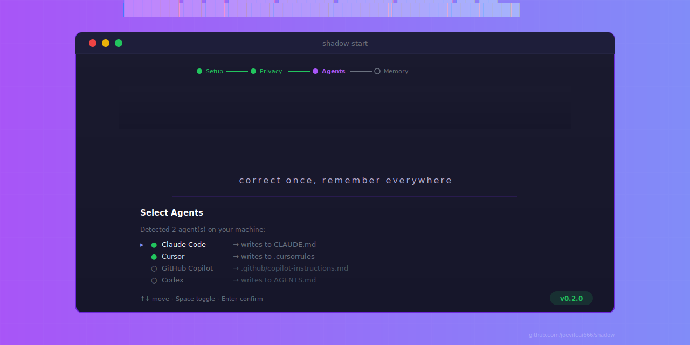

<p align="center">
  
</p>

<h1 align="center">Shadow</h1>

<p align="center">
  <strong>Your AI agent memory layer — correct once, remember everywhere.</strong>
</p>

<p align="center">
  Shadow captures your corrections to coding agents and turns them into<br>
  persistent rules that work across <strong>all</strong> your tools.
</p>

<p align="center">
  <a href="#install"><strong>Install</strong></a> ·
  <a href="#quick-start"><strong>Quick Start</strong></a> ·
  <a href="#how-it-works"><strong>How It Works</strong></a> ·
  <a href="docs/quickstart.md"><strong>Full Guide</strong></a>
</p>

<p align="center">
  
  
  
</p>

---

## Why Shadow?

You use multiple coding agents — Claude Code, Cursor, Copilot, Codex.
Every time you correct one, you teach it. Then you switch tools and
teach the same lesson again.

**Shadow fixes this.** It watches your corrections, distills them into
rules, and writes those rules into every agent's native context file.
One correction, every tool remembers.

## Features

<table>
<tr>
<td width="50%">

### 🔍 Auto-Capture
Shadow watches your agent sessions and detects corrections automatically — explicit instructions, manual edits, repeated patterns. No manual input required.

</td>
<td width="50%">

### 🧠 Smart Distillation
Raw corrections are distilled into concise, structured rules. LLM-powered when available, rule-based fallback always. Confidence scores and conflict detection built in.

</td>
</tr>
<tr>
<td width="50%">

### 🔄 Multi-Agent Sync
One rule, everywhere. Shadow writes to each agent's native format — `CLAUDE.md`, `.cursorrules`, `AGENTS.md`, `.github/copilot-instructions.md`. Safe merge with managed blocks.

</td>
<td width="50%">

### 🏠 Local-First & Private
All data stays under `~/.shadow/`. No login required. Keys and tokens are blocked before storage. Managed blocks are fully removable. Your rules, your machine.

</td>
</tr>
</table>

## How It Works

```
┌─────────────────────────────────────────────────────────────┐
│  You correct an agent                                       │
│  "No, this project uses pnpm, not npm"                      │
└──────────────────────────┬──────────────────────────────────┘
                           │
                           ▼
┌─────────────────────────────────────────────────────────────┐
│  1. CAPTURE — Shadow detects the correction signal           │
│     Sources: agent logs · git hooks · manual marks           │
└──────────────────────────┬──────────────────────────────────┘
                           │
                           ▼
┌─────────────────────────────────────────────────────────────┐
│  2. DISTILL — Correction becomes a structured rule           │
│     "Always use pnpm for package management" (confidence 0.9)│
└──────────────────────────┬──────────────────────────────────┘
                           │
                           ▼
┌─────────────────────────────────────────────────────────────┐
│  3. WRITE — Rule syncs to every connected agent              │
│     ✓ CLAUDE.md    ✓ .cursorrules    ✓ AGENTS.md            │
└──────────────────────────┬──────────────────────────────────┘
                           │
                           ▼
┌─────────────────────────────────────────────────────────────┐
│  4. REMEMBER — Next time, every agent gets it right          │
└─────────────────────────────────────────────────────────────┘
```

## Install

### Homebrew (recommended)

```bash
brew tap joevilcai666/shadow
brew install --formula joevilcai666/shadow/shadow
```

### Binary Download

Download the latest archive for your platform from
[GitHub Releases](https://github.com/joevilcai666/shadow/releases).

```bash
# macOS (Apple Silicon)
tar xzf shadow_*_darwin_arm64.tar.gz
sudo mv shadow /usr/local/bin/

# macOS (Intel)
tar xzf shadow_*_darwin_x86_64.tar.gz
sudo mv shadow /usr/local/bin/
```

### Build from Source

```bash
git clone https://github.com/joevilcai666/shadow.git
cd shadow
make build
sudo make install
```

## Quick Start

### 1. Start the daemon + onboarding wizard (~60 seconds)

```bash
cd your-project   # any Git repo
shadow start
```

You'll see the Shadow TUI onboarding:

```
 ██████  ██   ██  █████   ██████  ██████   ██████  ██     ██
██       ██   ██ ██   ██ ██    ██ ██   ██ ██    ██ ██     ██
███████  ███████ ███████ ██    ██ ██   ██ ██    ██ ██  █  ██
     ██ ██   ██ ██   ██ ██    ██ ██   ██ ██    ██ ██ ███ ██
 ██████ ██   ██ ██   ██  ██████  ██████   ██████   ███ ███

  correct once, remember everywhere.

✓━━━━━✓━━━━━●━━━━━○
Setup  Privacy Agents Memory

Welcome to Shadow!

This will take about 60 seconds. Everything stays local.

Your data:
  ✓ Stored only on this machine
  ✓ Never uploaded without your consent
  ✓ Keys/tokens automatically blocked

Press Enter to begin...
```

Press **Enter** → accept privacy → select your agents → scan project → done.

### 2. Open the web console

```bash
shadow open
```

Browse to `http://localhost:7878` — review rules, view the memory map, manage adapters.

### 3. Review candidate rules

```bash
shadow review
```

Approve or reject candidate rules in the terminal. Approved rules sync to all connected agent context files.

> **That's it.** Shadow now runs silently in the background, capturing your corrections and keeping your agents in sync.

## Commands

| Command | Description |
|---------|-------------|
| `shadow start` | Start daemon + onboarding TUI |
| `shadow status` | Check daemon status |
| `shadow open` | Open web console in browser |
| `shadow review` | Review candidate rules in terminal |
| `shadow serve` | Run daemon in foreground (dev) |
| `shadow mcp` | Print MCP server wiring for agent hosts |
| `shadow stop` | Stop the daemon |
| `shadow uninstall --clean-blocks` | Uninstall and remove managed blocks |
| `shadow version` | Print version |

## Supported Agents

| Agent | Target File | Scope |
|-------|------------|-------|
| Claude Code | `CLAUDE.md` + `~/.claude/CLAUDE.md` | Project + Global |
| Cursor | `.cursorrules` + `~/.cursorrules` | Project + Global |
| GitHub Copilot | `.github/copilot-instructions.md` | Project |
| Codex | `AGENTS.md` + `~/AGENTS.md` | Project + Global |

## Web Console

Shadow includes a local web console at `http://localhost:7878`:

- **Memory Map** — Visualize your rule graph and relationships
- **Rules** — Search, filter, create, edit, delete rules
- **Review** — Approve or reject candidate rules
- **Conflicts** — Resolve conflicting rules
- **Projects** — Manage registered projects
- **Settings** — Configure adapters, capture, and privacy

## Architecture

```
┌─────────────────────────────────────────────────────────────┐
│  localhost:7878 (Web Console)                               │
│  Memory Map · Rules · Review · Projects · Settings          │
└──────────────────────────┬──────────────────────────────────┘
                           │ HTTP + WebSocket
┌──────────────────────────▼──────────────────────────────────┐
│  CLI (`shadow start/review/status/...`)                     │
│  Cobra commands · Bubble Tea TUI                            │
└──────────────────────────┬──────────────────────────────────┘
                           │ Unix socket IPC
┌──────────────────────────▼──────────────────────────────────┐
│  Local Daemon (launchd)                                     │
│  Capture Engine · Distill Engine · Adapter Loop              │
│  SQLite storage · fsnotify · MCP server                     │
└──────────────────────────┬──────────────────────────────────┘
                           │ Read/Write
┌──────────────────────────▼──────────────────────────────────┐
│  Agent Context Files                                        │
│  CLAUDE.md · .cursorrules · AGENTS.md · copilot-instructions│
└─────────────────────────────────────────────────────────────┘
```

## Privacy Promise

- All data stored locally under `~/.shadow/`
- No login required for local use
- API keys, tokens, and credentials are blocked by deny patterns before storage
- Only distilled rules are stored — never raw conversations
- Managed blocks are fully removable with `shadow uninstall --clean-blocks`

## Development

```bash
make web-setup      # Install web dependencies
make build          # Build binary with embedded web assets
make test           # Run Go tests
make vet            # Run go vet
make dev            # Start daemon + web dev server concurrently
make web-static     # Build web assets and embed into Go binary
```

## Roadmap

- [ ] Cross-device cloud sync (optional, opt-in)
- [ ] Rule sharing and community library
- [ ] Windows support
- [ ] IDE extensions (VS Code, JetBrains)
- [ ] Multi-user / team mode

## Documentation

- [Quick Start Guide](docs/quickstart.md) — detailed step-by-step walkthrough
- [Release Guide](RELEASE.md) — how to cut a release

## License

[MIT](LICENSE) — Copyright © 2026 Shadow contributors
